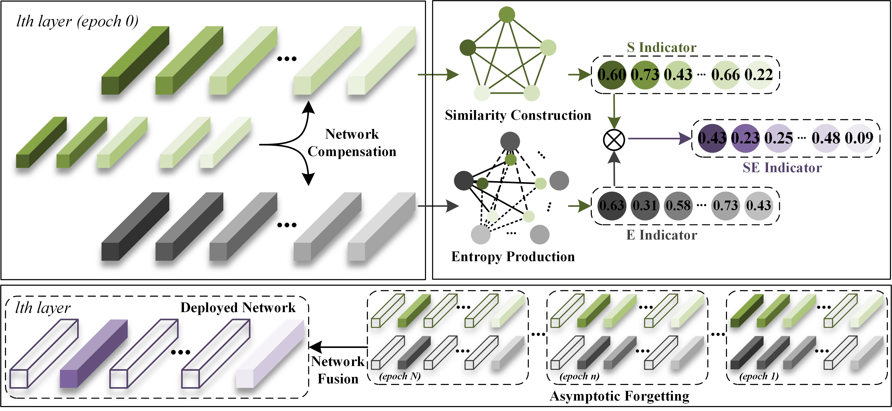
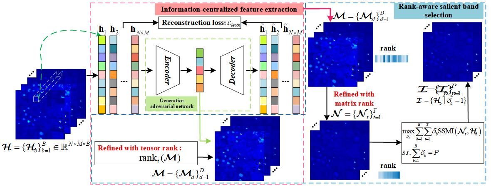
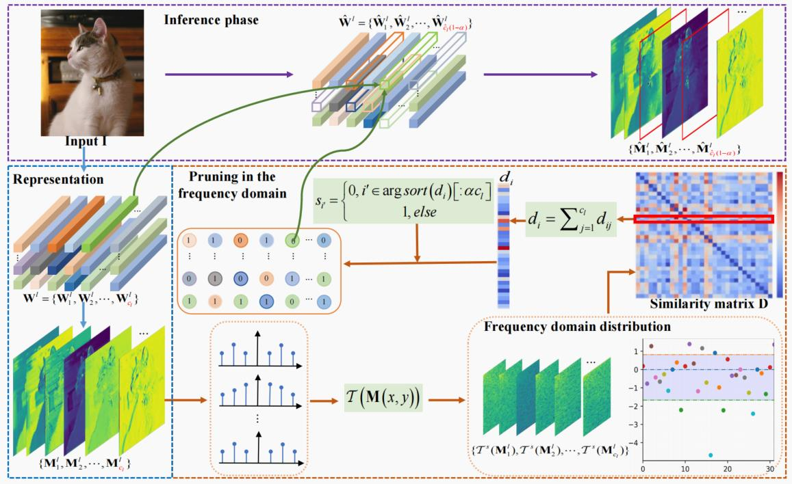
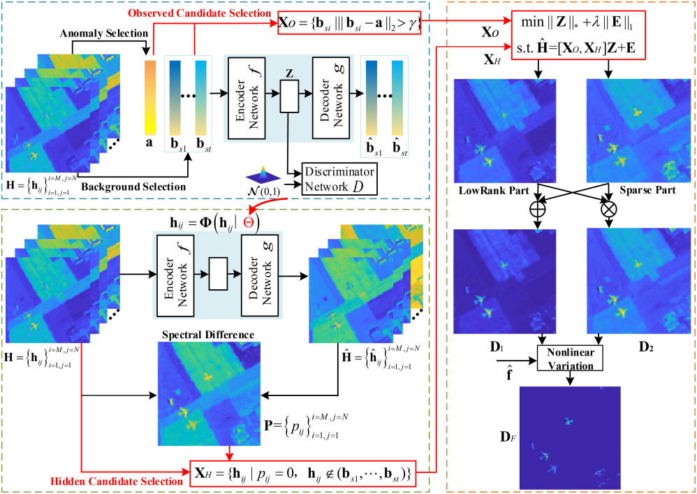
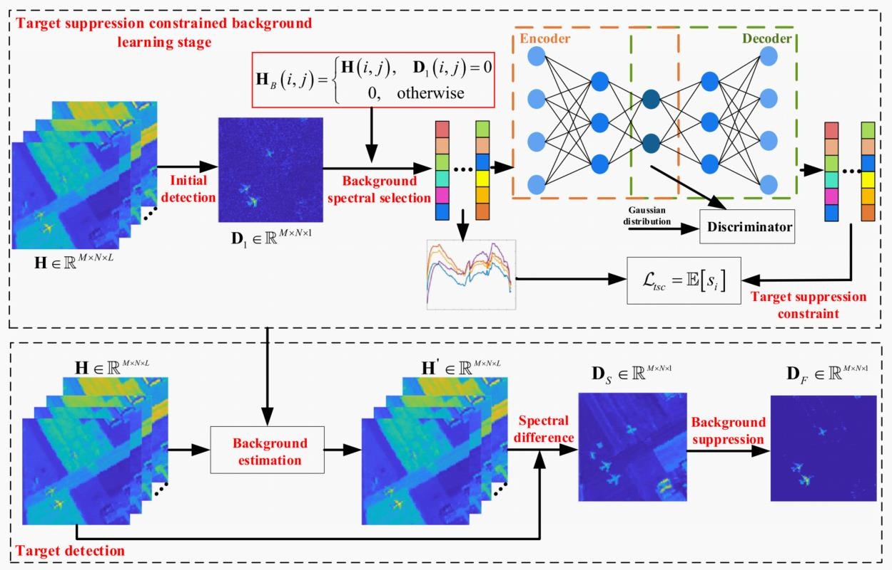

My research interests span efficient deep learning, machine learning, and computer vision. Specifically, I am interested in model compression for computer vision models (CNN, ViT), knowledge distillation to both models and datasets, and general CV tasks (foundational model training and downstream applications).

News!
======
[2024.2] One paper is accepted by CVPR! [Paper](https://scholar.google.com/citations?view_op=view_citation&hl=zh-CN&user=rJMMViQAAAAJ&citation_for_view=rJMMViQAAAAJ:Tyk-4Ss8FVUC) [Codes](https://github.com/zhangxin-xd/Dataset-Pruning-TDDS)

[2023.10] Win National Scholarship for PhD Student

Publications
======

  
  
  **[CVPR 2024]** Spanning Training Progress: Temporal Dual-Depth Scoring (TDDS) for Enhanced Dataset Pruning. **Xin Zhang**, Jiawei Du, Yunsong Li, Weiying Xie, Joey Tianyi Zhou.

  
  
  **[IEEE TNNLS 2023]** Block-Wise Partner Learning for Model Compression. **Xin Zhang**, Weiying Xie, Yunsong Li, Jie Lei, Kai Jiang, Leyuan Fang, Qian Du.

  
  
  **[IEEE TIP 2023]** Reaf: Remembering enhancement and entropy-based asymptotic forgetting for filter pruning. **Xin Zhang**, Weiying Xie, Yunsong Li, Kai Jiang, Leyuan Fang.

  
  
  **[IEEE TGRS 2023]** A Model-Driven Deep Mixture Network for Robust Hyperspectral Anomaly Detection. Yunsong Li, Kai Jiang, Weiying Xie, Jie Lei, **Xin Zhang**, Qian Du

  
  
  **[IEEE TGRS 2022]** Rank-aware generative adversarial network for hyperspectral band selection. **Xin Zhang**, Weiying Xie, Yunsong Li, Jie Lei, Qian Du, Geng Yang.

  
  
  **[IEEE TGRS 2023]** Co-compression via superior gene for remote sensing scene classification. Weiying Xie, Xiaoyi Fan, **Xin Zhang**, Yunsong Li, Min Sheng, Leyuan Fang.

  
  
  **[IEEE TGRS 2022]** Algorithm/hardware codesign for real-time on-satellite CNN-based ship detection in SAR imagery. Geng Yang, Jie   Lei, Weiying Xie, Zhenman Fang, Yunsong Li, Jiaxuan Wang, **Xin Zhang**.

  
  
  **[IEEE TC 2021]** Filter pruning via learned representation median in the frequency domain. **Xin Zhang**, Weiying Xie, Yunsong Li, Jie Lei, Qian Du.

  
  
  **[IEEE TC 2021]** Weakly supervised low-rank representation for hyperspectral anomaly detection. Weiying Xie, **Xin Zhang**, Yunsong Li, Jie Lei, Jiaojiao Li, Qian Du.

  
  
  **[IEEE Jstar 2020]** Background learning based on target suppression constraint for hyperspectral target detection. Weiying Xie, **Xin Zhang**, Yunsong Li, Keyan Wang, Qian Du.

